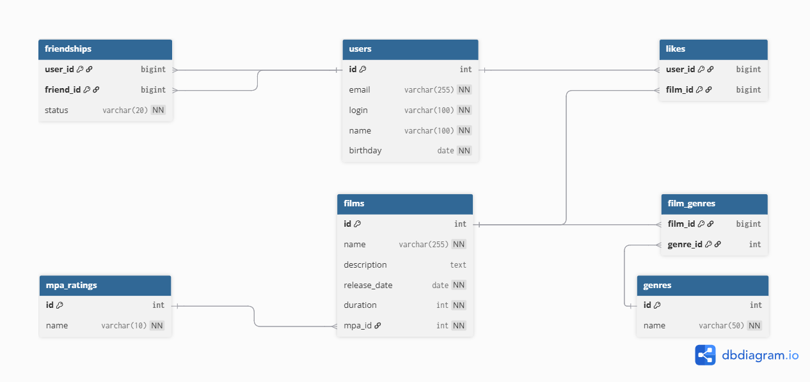

# Filmorate

## Схема базы данных



### Описание таблиц

**Основные таблицы:**

- `users` - пользователи
- `films` - фильмы
- `mpa_ratings` - возрастные рейтинги (G, PG, PG-13, R, NC-17)
- `genres` - жанры фильмов

**Таблицы связей:**

- `film_genres` - связь фильмов с жанрами (многие ко многим)
- `likes` - лайки фильмам от пользователей
- `friendships` - дружеские связи между пользователями со статусом (PENDING неподтверждённая/CONFIRMED подтверждённая)

### Особенности рабочей логики приложения:

1. Для дружбы нужно подтверждение
   - **PENDING** - запрос отправлен, но требует подтверждения
   - **CONFIRMED** - дружба подтверждена
2. Для определения популярных фильмов учитываются лайки пользователей
3. Валидация данных выполняется в приложении:
    - Email и логин должны быть уникальными
    - Дата релиза фильма не может быть раньше 28.12.1895
    - Дата рождения пользователя не может быть в будущем

### Примеры SQL запросов

#### Получить все данные о всех фильмах
```SQL
SELECT * FROM films
```

#### Получить все данные о всех пользователях
```SQL
SELECT * FROM users
```

#### Получить все данные о пользователе по его номеру
```SQL
SELECT * FROM users WHERE user_id = 0 /*подставить нужный user_id*/
```

#### Получить все данные о фильме по его номеру
```SQL
SELECT * FROM films WHERE film_id = 0 /*подставить нужный film_id*/
```

#### Получить всех друзей пользователя по его номеру
```SQL
SELECT friend_id FROM friendships
WHERE status = 'CONFIRMED' AND user_id = 0 /*подставить нужный user_id*/
```

#### Получить все фильмы по жанру
```SQL
SELECT f.id, f.name
FROM films AS f
JOIN film_genres AS fg ON f.film_id = fg.film_id
JOIN genres g ON fg.genre_id = g.genre_id
WHERE g.name = 'PG'  /*подставить нужное название жанра*/
```

#### Получить все жанры
```SQL
SELECT name FROM genres
```

#### Получить все рейтинги
```SQL
SELECT code, description FROM mpa_ratings
```

#### Получить все фильмы понравившиеся пользователю
```SQL
SELECT f.name
FROM films AS f
JOIN likes AS l ON f.film_id = l.film_id
WHERE l.user_id = 0 /*подставить нужный user_id*/
```